それでは早速、PostgreSQLのインストール方法をご紹介します。

# インストーラのダウンロード

まずはEDB社の公式サイトにアクセスします（EDB社とは、PostgreSQLのエンタープライズ向け拡張・サポートを提供する会社です）。

https://www.enterprisedb.com/downloads/postgres-postgresql-downloads

今回は、Windows 11にバージョン17をインストールします。「Windows x86-64」と「17.x」が交わったところの矢印を選択してください。

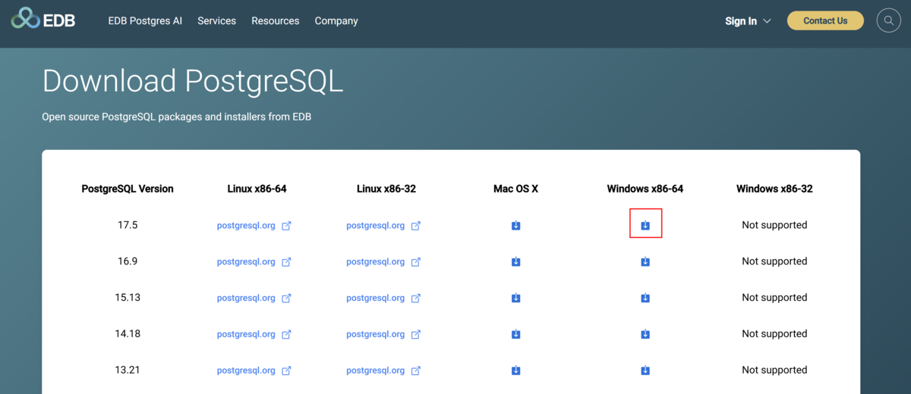

別のページに遷移して、ダウンロードが開始されます。

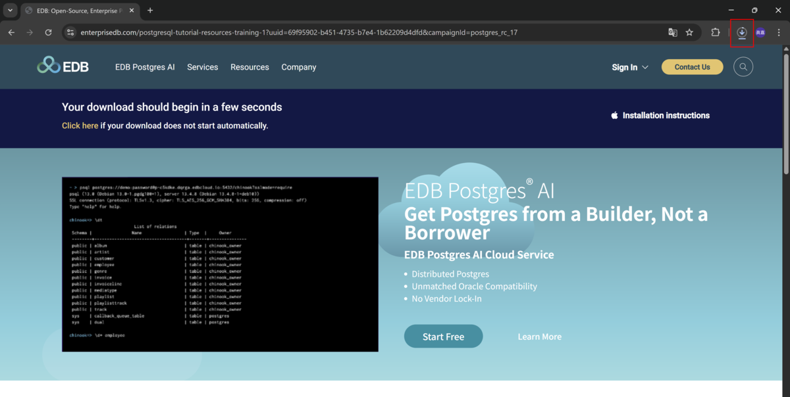

ここからは.exeファイルを実行する作業へと移ります。

# .exeファイルの実行

ダウンロードフォルダに *postgresql-17.5-1-windows-x64.exe* がインストールされます。こちらをダブルクリックで実行します。

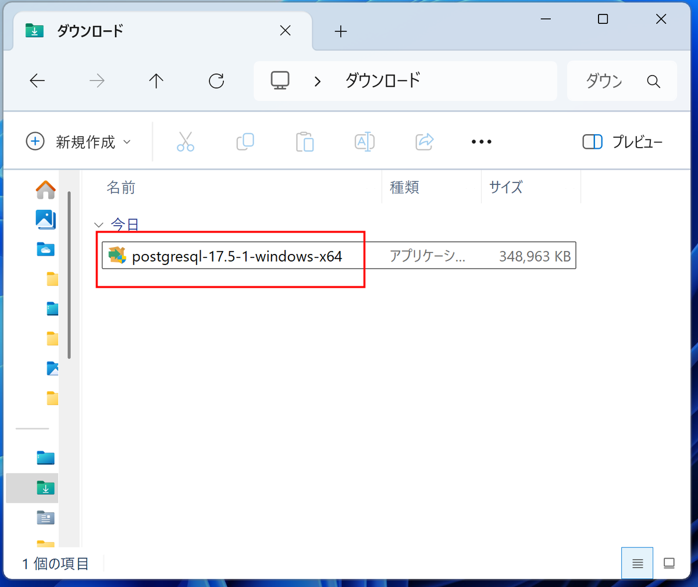

自動的にセットアップの画面が起動します。[Next] を選択します。

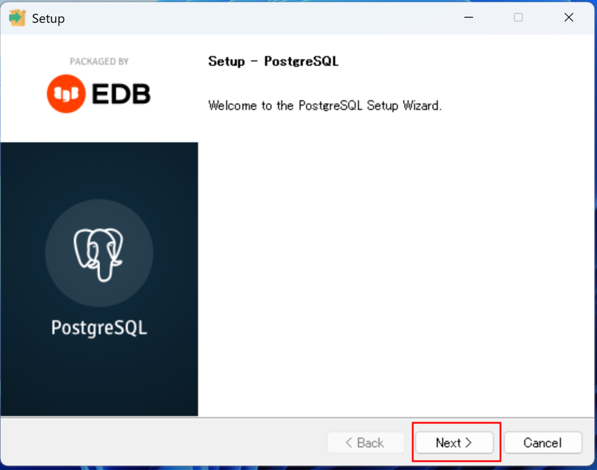

インストール先のフォルダを指定します。デフォルトでは、C:\Program Files\PostgreSQL\17になります。特に変更は必要ないので、[Next] を選択します。

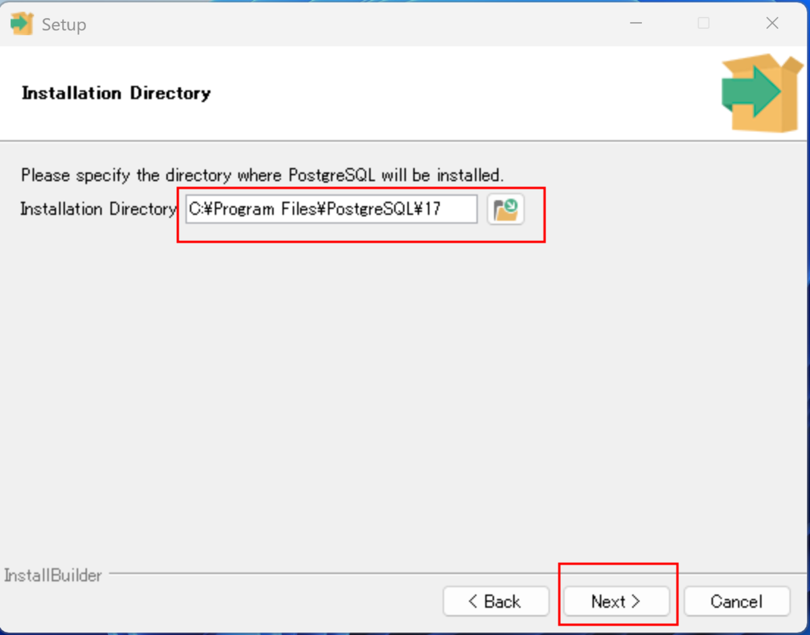

インストールするコンポーネントを選択します。こちらも特に変更は必要ないので、[Next] を選択します。

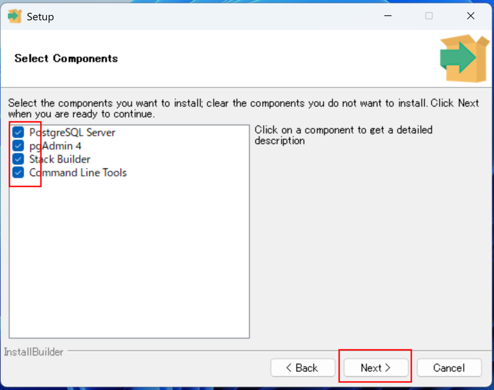

データディレクトリを選択します。データディレクトリとは、PostgreSQLがデータベースのファイルを保存する場所です。そのまま [Next] を選択します。

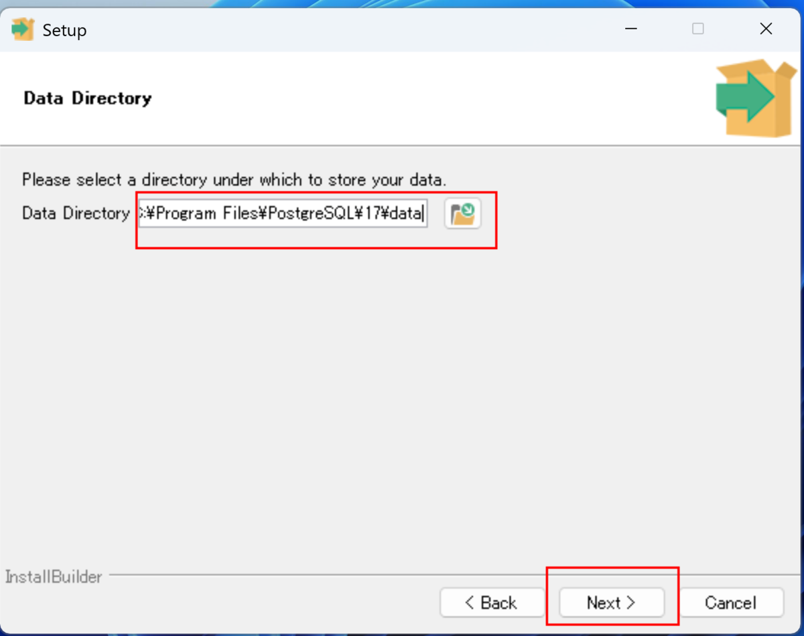

パスワードを指定します。パスワードは確認のため、同じものを2回入力します。入力できたら、[Next] をクリックします。

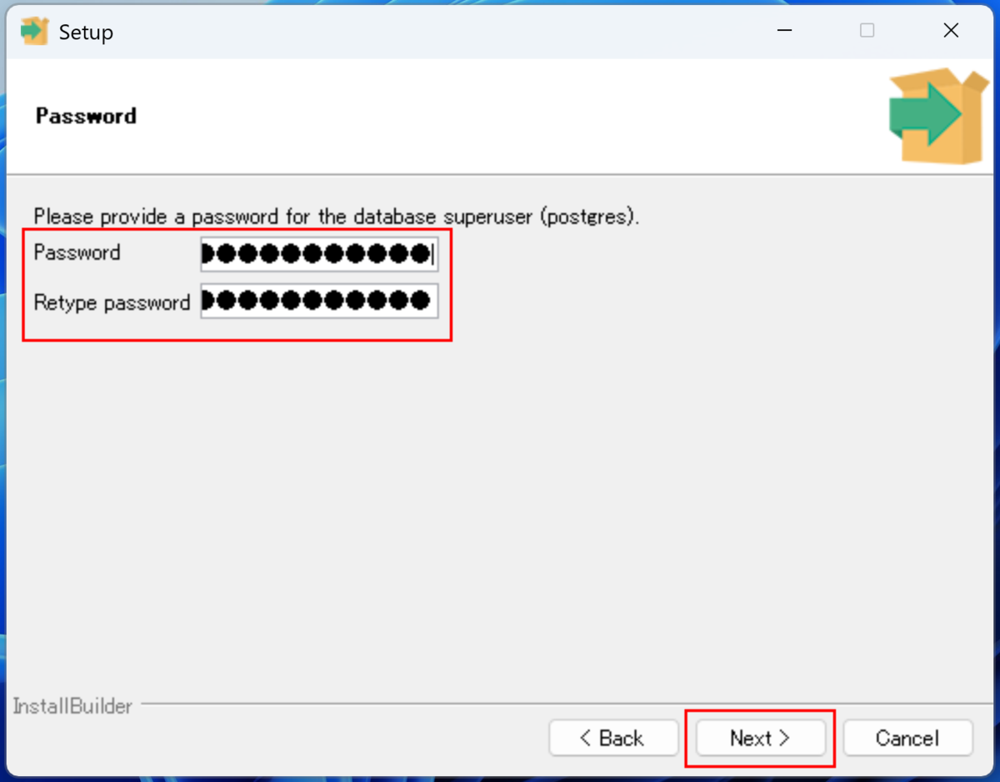

クライアントからの接続を受けつけるポート番号を入力します。デフォルトでは5432ポートになります。問題なければ、[Next] を選択します。

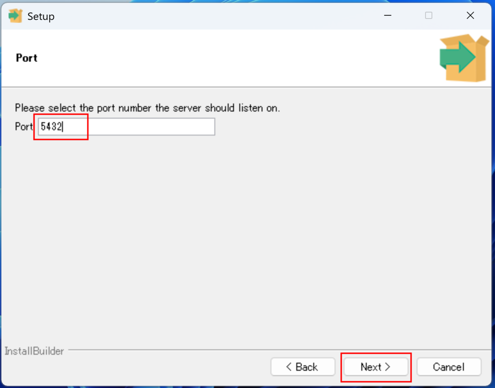

デフォルトのロケールを選択します。[Japanese, Japan] を選択して、[Next] をクリックします。

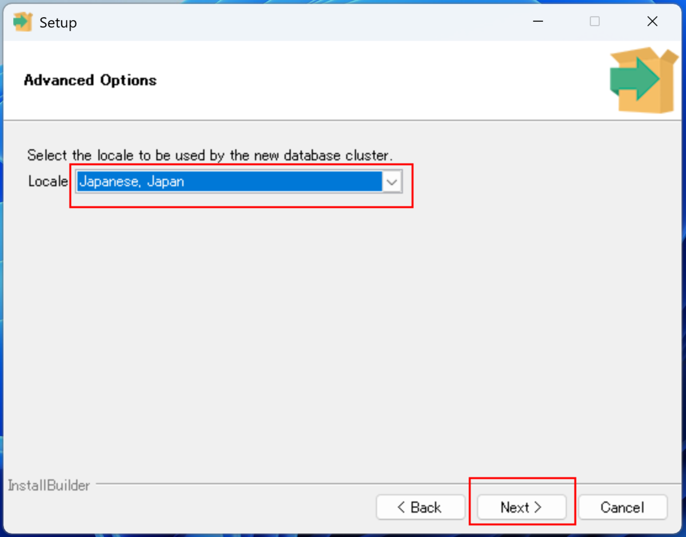

インストールの設定内容を確認する画面が出てくるので、問題なければ [Next] を選択します。

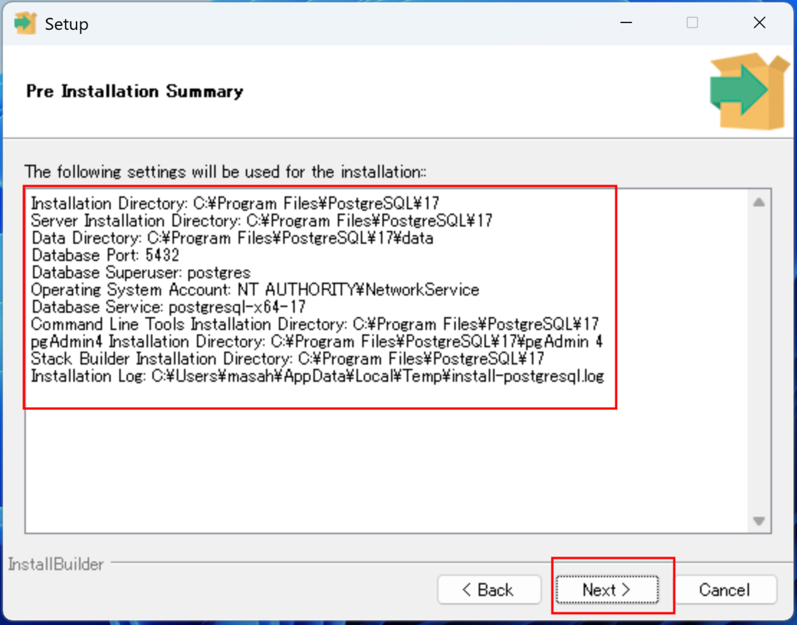

最終の確認画面が出てきます。このままインストールでよければ [Next] を選択します。

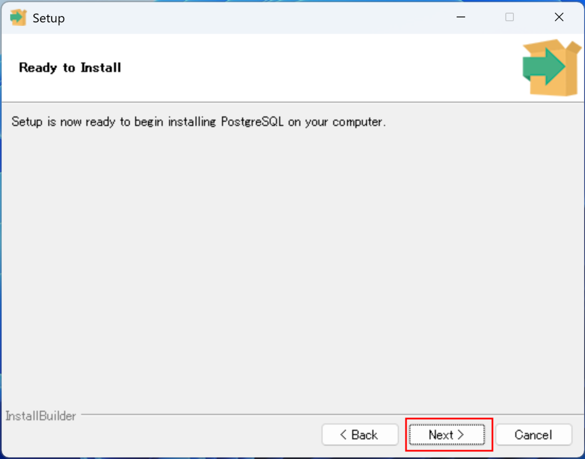

インストール作業が開始されますので、しばらく待ちます。

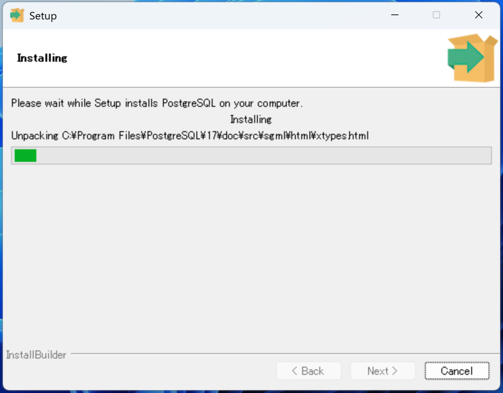

こちらの画面が出ればインストールは完了です。

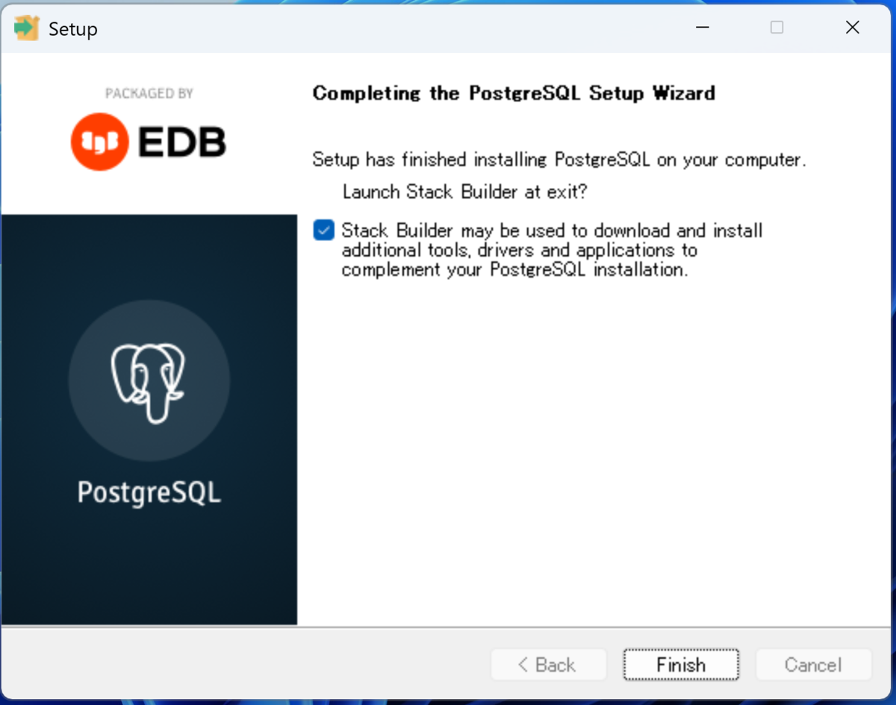

