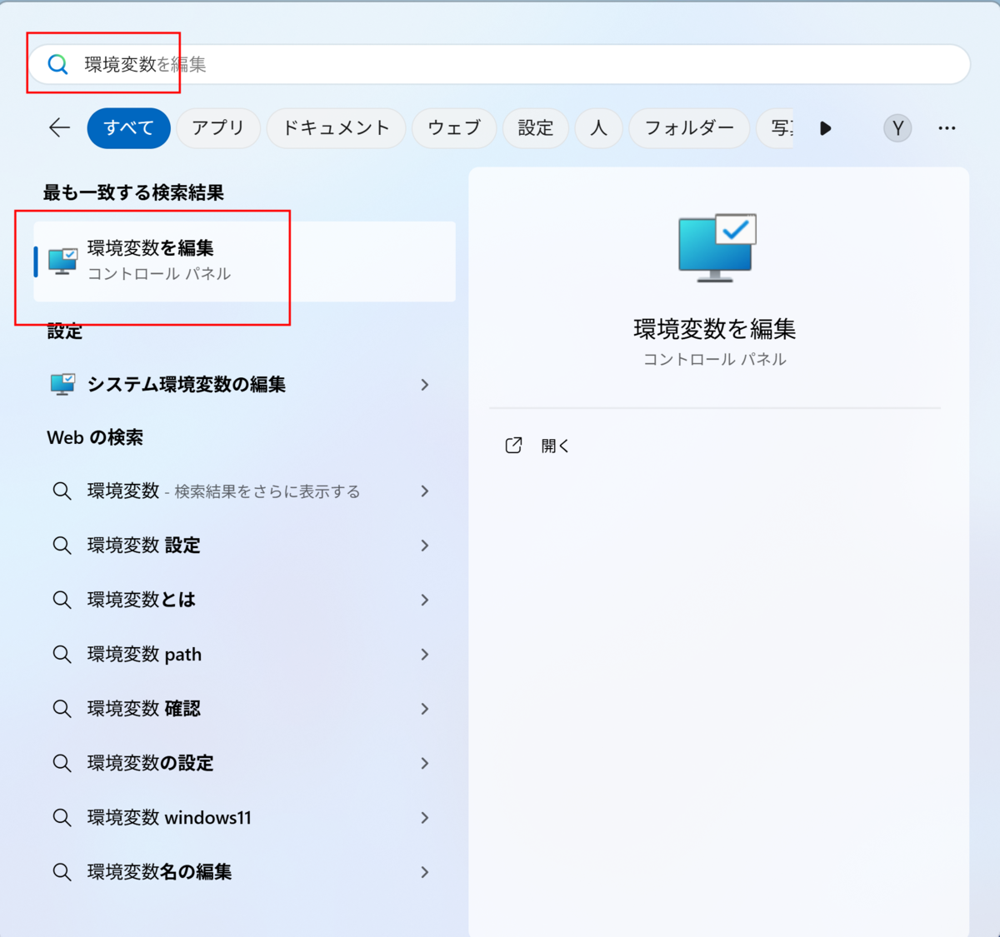
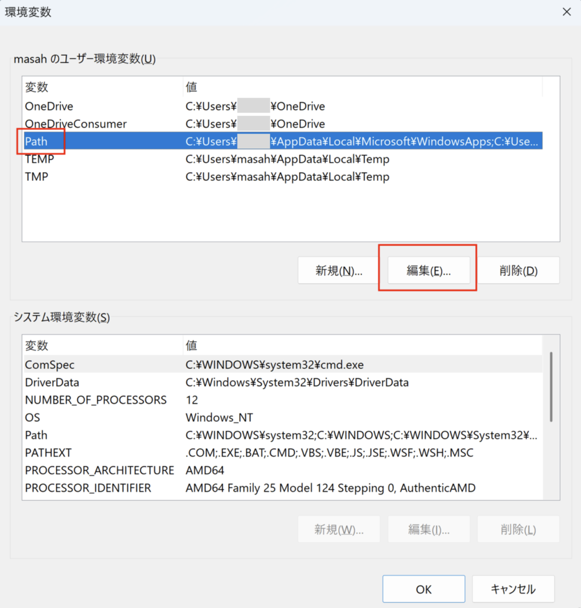
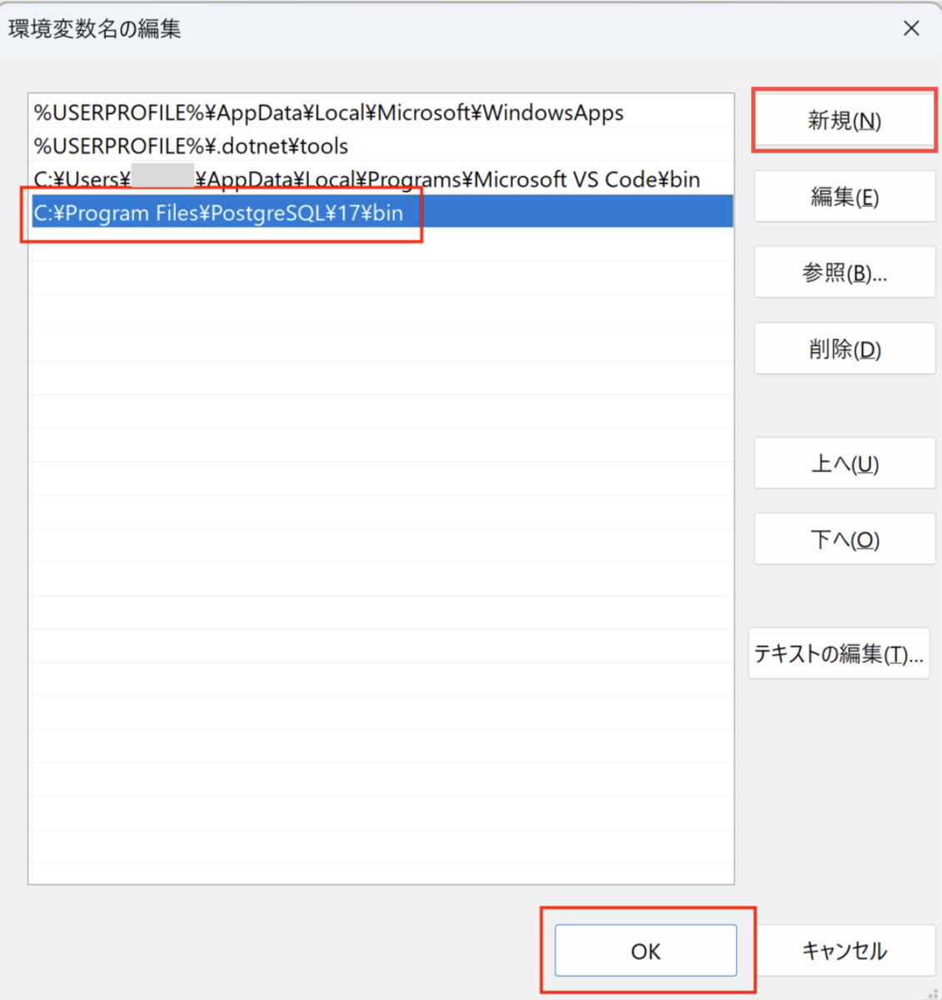

PostgreSQLをインストールしたら、次は環境変数を設定します。環境変数を設定することで、**どのフォルダからでもPostgreSQLのコマンドを実行できるようになります。**

# 環境変数の設定方法

Windowsキーを押して「環境変数」と検索し、[環境変数を編集] を選択します。

<div style="text-align: center;">

</div>

[Path] を選択した状態で、[編集] ボタンをクリックします。

<div style="text-align: center;">

</div>

こちらに新しいパスを登録します。[新規] を選択し、PostgreSQLのインストールパスを入力してください。通常は以下のパスになります：

```
C:\Program Files\PostgreSQL\17\bin
```

入力が完了したら、[OK] ボタンをクリックします。

<div style="text-align: center;">

</div>

これで環境変数の登録が完了しました。

# 動作確認

コマンドプロンプトを開いて以下のコマンドを入力してみてください：

```bash
psql --help
```

PostgreSQLのヘルプメッセージがずらーっと表示されれば、設定は成功です。

```bash
psql は PostgreSQL の対話型ターミナルです。

使い方:
  psql [オプション]... [データベース名 [ユーザー名]]
:
（これがずっと続いていく）
```

※）この環境変数の設定は一度だけ行えば大丈夫です。うまくいかない場合は、PCを再起動してから再度試してみてください。
