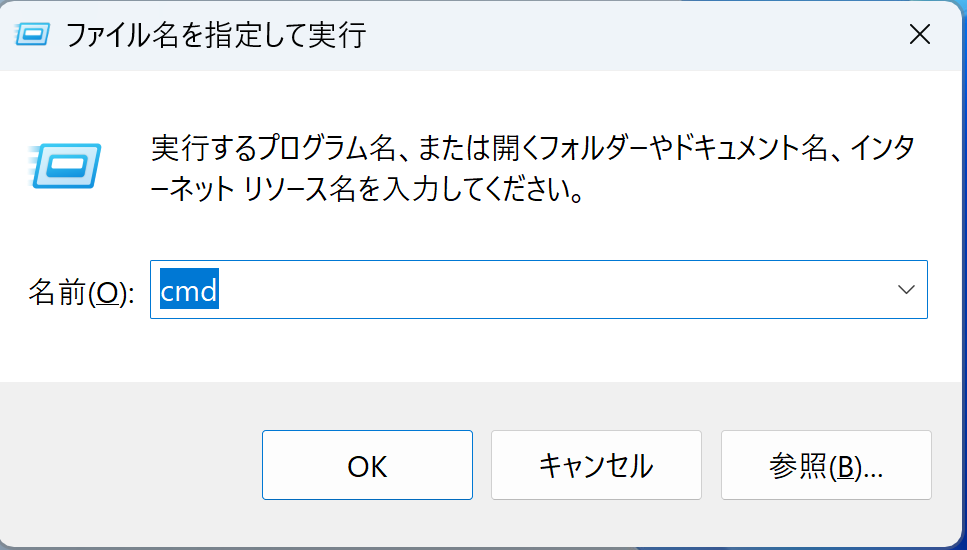
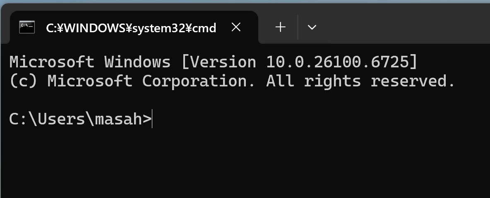
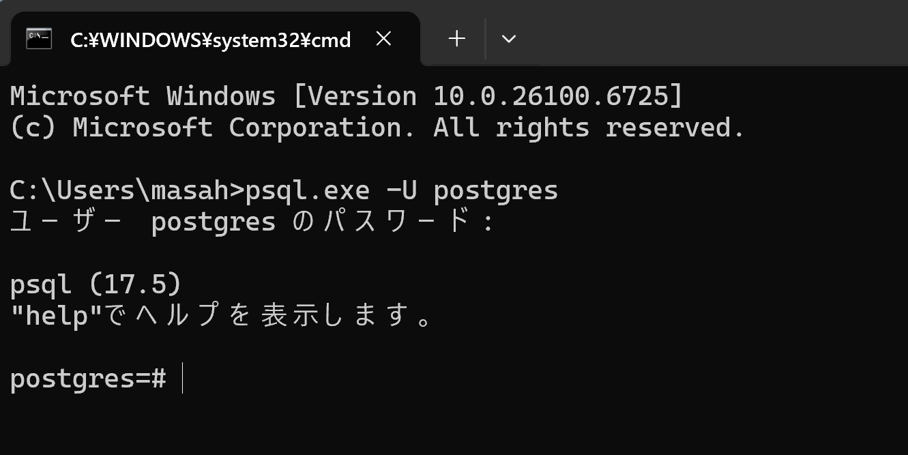
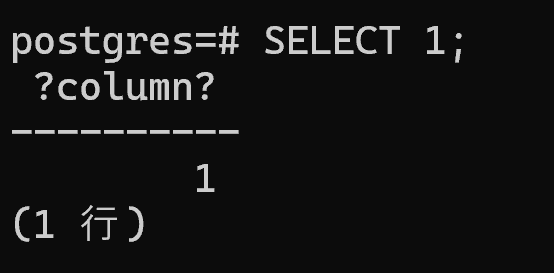

ここまでの内容で、PostgreSQLをPCにインストールし、環境変数の設定も行うことができました。このチャプターでは、実際にSQLを実行して、その動作を確認してみましょう。

PostgreSQLには、コマンドラインでSQLを実行できる「psql」というツールがあります。psqlは、記述したSQL文をPostgreSQLに送信し、その結果を受け取って表示する仕組みとなっています。ここでは、psqlによるPostgreSQLへの接続～実行までの方法をご紹介します。

# PostgreSQLへの接続（ログイン）

まずはコマンドプロンプトを起動しましょう。PCのスタート画面で、[Windows] キーを押しながら、[R] キーを押してください。すると、画面の左下に [ファイル名を指定して実行] のウィンドウが出てきます。

こちらの入力欄に「cmd」と半角で入力してください。cmdはコマンドプロンプトを起動するための命令です。入力したら、Enterキーを押すか、ウィンドウ内の「OK」ボタンをクリックします。

<div style="text-align: center;">

</div>

すると、コマンドプロンプトが起動します。こちらの画面から、PostgreSQLのデータベースにアクセスするためのpsqlコマンドを実行していきます。

<div style="text-align: center;">

</div>

上記の画面が開いたら、次のコマンドを入力してください。

```
psql.exe -U postgres
```

コマンドを実行すると、パスワードの入力を求められます。PostgreSQLをインストールした際に設定したパスワードを入力してください。セキュリティのため、パスワードを入力しても画面には何も表示されませんが、正しく入力されているのでご安心ください。入力が完了したら [Enter] キーを押します。

<div style="text-align: center;">

</div>

すると、コマンドプロンプトに「#psql」と表示され、PostgreSQLへの接続が完了します。この状態になれば、SQL文を実行できます。

# SQLの実行

データベースにログインできると、SQLを実行することができます。試しにカンタンなSQL文を実行して、動きを確かめてみましょう。

psqlでサンプルデータベース（postgres）にログインした状態で、次のコードを入力してください。

```
SELECT 1;
```

このコマンドは「1という数字を表示してください」という意味です。データベースから何かデータを取り出すわけではなく、単純に数字の1を返すだけの命令です。テーブルやデータを用意しなくても、データベースが応答するかどうかをすぐに確認できるため、接続テストによく使われます。

入力し終わったら、[Enter] キーを押してください。コマンドが正しく実行されると、画面には次のような結果が表示されます。

<div style="text-align: center;">

</div>

1という数字と、1行が返されたことを示すメッセージが表示されれば成功です。これで、データベースへの接続が正常に機能していることが確認できました。

# PostgreSQLの終了

作業が終わったら、PostgreSQLから正しくログアウトしましょう。psqlを終了するには、次のコマンドを入力します。

```
\q
```

`\q` は「quit（終了）」を意味するコマンドです。このコマンドを入力して [Enter] キーを押すと、PostgreSQLとの接続が切断され、通常のコマンドプロンプトの画面に戻ります。

その後、コマンドプロンプト自体を閉じる場合は、ウィンドウ右上の [×] ボタンをクリックするか、次のコマンドを入力してください。

```
exit
```

こちらでPostgreSQLの起動から終了までの一連の流れを行うことができました。
